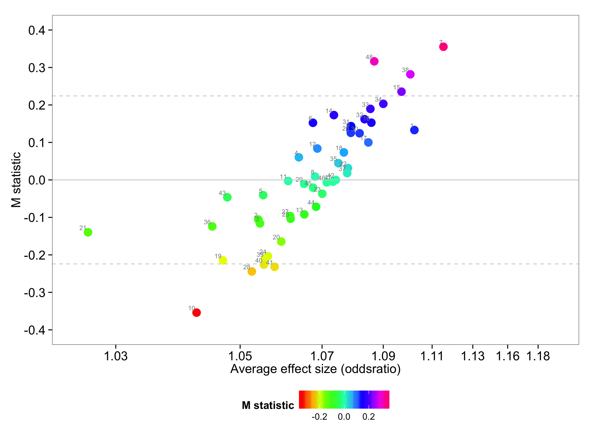

[](https://travis-ci.org/magosil86/getmstatistic)
[](https://raw.githubusercontent.com/magosil86/getmstatistic/master/LICENSE)
[](https://github.com/magosil86/getmstatistic/issues)


# [getmstatistic]() 

_M_ - An aggregate statistic, to identify systematic heterogeneity patterns and their direction of effect in meta-analysis 
 
## Overview
 
 _M_ quantitatively describes systematic (non-random) heterogeneity patterns acting across multiple variants in a GWAS meta-analysis. It's primary use is to identify outlier studies, which either show "null" effects or consistently show stronger or weaker genetic effects than average across, the panel of variants examined in a meta-analysis.

 _M_ differs from conventional heterogeneity metrics (Q-statistic, I<sup>2</sup>), in that, it measures heterogeneity across multiple independently associated variants, whilst (Q-statistic, I<sup>2</sup>) measure heterogeneity at individual variants. Essentially, _M_ measures systematic heterogeneity, whilst (Q-statistic, I<sup>2</sup>) measure random variant-specific heterogeneity.

### Sources of systematic heterogeneity
Systematic heterogeneity can arise in a meta-analysis due to differences in the study characteristics of participating studies. Some of the differences may include: ancestry, allele frequencies, phenotype definition, age-of-disease onset, family-history, gender, linkage disequilibrium and quality control thresholds.

### Practical benefits of exploring systematic heterogeneity

* Reveal studies showing systematically weaker effects than average which could lower the power of a meta-analysis to detect genetic signals. For example, outlier studies that pass typical quality control checks (genotype call rate, Hardy-Weinberg equilibrium cutoffs, genomic control) but might show no association with phenotype of interest due to faulty genotype data (e.g. flipped alleles and/or strands, incorrect minor allele frequencies).

* Reveal studies showing systematically stronger effects than average which can elucidate biologically important differences among the studies e.g. sexual dimorphism or sub-phenotype variability.


## Installation

* Install getmstatistic [**Stata** command](https://github.com/magosil86/getmstatistic)

```
1. Download the getmstatistic zip file: [getmstatistic_0.1.0_stata.zip](https://github.com/magosil86/getmstatistic/raw/master/getmstatistic_0.1.0_stata/getmstatistic_0.1.0_stata.zip)

2. Unzip the folder

3. Start stata

4. Locate your personal directory where stata stores user generated files by typing: `sysdir`
sysdir

on mac the ado/personal directory is likely to be at: ~/Library/Application Support/Stata/ado/personal/
for linux: ~/ado/personal/ 
for windows: c:\ado\personal\

5. Copy getmstatistic.ado and getmstatistic.sthlp to the g sub-directory in personal

6. Type help getmstatistic in Stata to open the help file. 

7. You're all set, getmstatistic is installed

```

* Install getmstatistic [**R** package](https://github.com/magosil86/getmstatistic)

```{r}
# To install the development version from GitHub:

# install devtools
install.packages("devtools")

# install getmstatistic
library(devtools)
devtools::install_github("magosil86/getmstatistic")

# Load libraries
library(getmstatistic)  # for calculating M statistics
library(gridExtra)      # for generating tables

```


## Usage

*  Take a look at an [example workflow](https://github.com/magosil86/getmstatistic/blob/master/vignettes/getmstatistic-tutorial.md)

## Details

* Essentially, _M_ statistics are computed by aggregating standardized predicted random effects (SPREs). To read up about the statistical theory behind the _M_ statistic see:

Magosi LE, Goel A, Hopewell JC, Farrall M, on behalf of the CARDIoGRAMplusC4D Consortium (2017) Identifying systematic heterogeneity patterns in genetic association meta-analysis studies. PLoS Genet 13(5): e1006755. [https://doi.org/10.1371/journal.pgen.1006755](https://doi.org/10.1371/journal.pgen.1006755).


## Getting help

To suggest new features, learn about getmstatistic updates, report bugs, ask questions about the mstatistic, or just interact with other users, sign up to the [getmstatistic](https://groups.google.com/forum/#!forum/getmstatistic) mailing list.


## Code of conduct
Contributions are welcome. Please observe the [Contributor Code of Conduct](https://github.com/magosil86/getmstatistic/blob/master/CONDUCT.md) when participating in this project.

## Citation
Magosi LE, Goel A, Hopewell JC, Farrall M, on behalf of the CARDIoGRAMplusC4D Consortium (2017) Identifying systematic heterogeneity patterns in genetic association meta-analysis studies. PLoS Genet 13(5): e1006755. [https://doi.org/10.1371/journal.pgen.1006755](https://doi.org/10.1371/journal.pgen.1006755).


## Acknowledgements.
Roger M. Harbord’s metareg command for computation of standardized predicted random effects which are then incorporated into calculations for the _M_ statistics. Harbord, R. M., & Higgins, J. P. T. (2008). Meta-regression in Stata. Stata Journal 8: 493‚Äì519.


## Authors.
Lerato E. Magosi, Jemma C. Hopewell and Martin Farrall.

## Maintainer.
Lerato E. Magosi lmagosi@well.ox.ac.uk or magosil86@gmail.com

## License

See the [LICENSE](https://github.com/magosil86/getmstatistic/blob/master/LICENSE) file.

